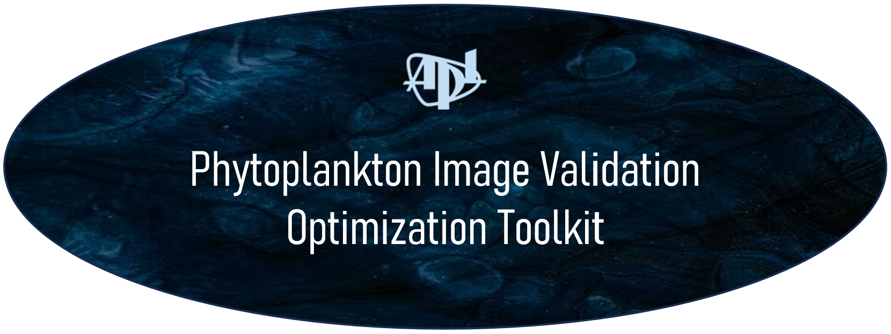
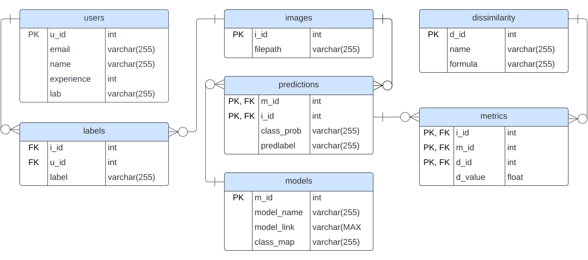

[](https://coveralls.io/github/chandlerault/PIVOT?branch=main)
<a id="introduction"></a>
## Introduction
There is an urgent need to accurately quantify oceanic phytoplankton to understand their role in the global Carbon Cycle. Collaborating with the Air-Sea Interaction & Remote Sensing department at the University of Washington Applied Physics Lab, our M.S. Data Science capstone group developed an interactive tool to validate Convolutional Neural Network (CNN) classified phytoplankton images efficiently using a novel, Active Learning inspired method.

Currently, the prevailing method for label validation in this field involves manual labeling of each image, which is complex, time-consuming, and lacks comprehensive performance tracking. PIVOT, the in-house solution to validate CNN-labeled images, is intuitive and enables researchers to correct mislabeled images efficiently while also tracking model performance. This tool selects strategic subsets of interspersed low-confidence & random image predictions for validation, facilitating a human-in-the-loop approach to evaluate model performance while also accumulating a valuable dataset for subsequent use in semi-supervised model retraining.


#### Team Members:
| Name | GitHub | Name | GitHub |
|:------:|:------:|:------:|:------:|
| **Yash Manne** | *yashmanne*| **Yamina Katariya** | *YaminaKat7* |
| **Aditi Shrivastava** | *ad-iti* | **Chandler Ault** | *chandlerault* |

## Table of Contents
* [Introduction](#introduction)
* [Tasks of Interest](#tasks-of-interest)
* [Repository Structure](#repository-structure)
* [Installation](#installation)
  * [Environment](#environment)
* [Data](#data)
  * [Storage](#storage)
  * [Model Pipeline](#pipeline)
* [Application](#application)
* [Final Submission](#final_docs)

<a id="tasks-of-interest"></a>
## Tasks of Interest
- **Individual Plankton Image Validation**:
  - Allow users autonomy over the images they label.
  - Provide a user-friendly interface for researchers to manually validate CNN-predicted labels.
- **Summary Metric Dashboard**:
  - Showcase several visual representations illustrating summary statistics for the trained model, accompanied by the outcomes of unseen datasets when executed on the trained model.
  - Allow users to select the models they wish to evaluate.
- **Phytoplankton Labeling Resource Guide**:
  - Proivde resources for users to reference for determining phytoplankton categories based on images. 
  
<a id="repository-structure"></a>
## Repository Structure
Here is an overview of our project structure:
```
├── PIVOT/
│   ├── app_pages/
│   │   ├── data/
│   │   │   ├── test_summary.py
│   │   │   ├── train_summary.py
│   │   ├── about.py
│   │   ├── config_file.py
│   │   ├── dashboard.py
│   │   ├── image_validation.py
│   │   ├── resources.py
│   ├── config/
│   │   ├── config.yaml
│   ├── data/
│   │   ├── model-summary-cnn-v1-b3.csv
│   ├── images/
|   |   ├── phytoplankton/
|   |   |   ├── chloro/
|   |   |   ├── ciliates/
|   |   |   ├── crypto/
|   |   |   ├── diatoms/
|   |   |   ├── dictyo/
|   |   |   ├── dinoflagellates/
|   |   |   ├── eugleno/
|   |   |   ├── other/
|   |   |   ├── pyrmnesio/
│   │   ├── apl-uw_logo-over.png
│   │   ├── ER.svg
│   │   ├── IV.svg
│   │   ├── phyto_image.jpg
│   │   ├── PIVOT_title.png
│   │   ├── Rhode_Island.png
│   │   ├── SYS.svg
│   │   ├── tiny_drifters.jpeg
│   │   ├── WHOI_PrimaryLogo.png
│   │   ├── exploratory_plots.png
│   ├── tests/
│   │   ├── __init__.py
│   │   ├── test_app_utils.py
│   │   ├── test_dashboard_utils.py
│   │   ├── test_data_utils.py
│   │   ├── test_sql_utils.py
│   │   ├── test_utils_config.py
│   ├── utils/
│   │   ├── stored_procedures/
│   │   │   ├── Generate_Random_Test_Set.sql
│   │   │   ├── Images_To_Meterize.sql
│   │   │   ├── Images_To_Predict.sql
│   │   │   ├── Labeling_Rankings.sql
│   │   │   ├── Model_Evaluation_Filtering.sql
│   │   │   ├── Model_Evaluation_NonTest.sql
│   │   │   ├── Model_Training.sql
|   |   ├── model_serving/
│   │   │   ├── deploy.py
│   │   │   ├── mlflow_log.py
│   │   │   ├── model-cnn-v1-b3.h5
│   │   │   ├── model-cnn-v1-b3.json
│   │   │   ├── score.py
│   │   │   ├── scoring_data.json
│   │   ├── __init__.py
│   │   ├── app_utils.py
│   │   ├── dashboard_utils.py
│   │   ├── data_utils.py
│   │   ├── insert_data.py
│   │   ├── model_utils.py
│   │   ├── sql_constants.py
│   │   ├── sql_utils.py
│   ├── app.py
│   ├── create_db.sql
├── .gitignore
├── environment.yml
├── LICENSE
├── pylintrc
├── README.md (Current File)

```

<a id="installation"></a>
## Installation

This repository can be cloned locally by running the following `git` command:
```bash
git clone https://github.com/chandlerault/PIVOT.git
```
Please note that Git is required to run the above command. For instructions on downloading Git, please see [the GitHub guide](https://github.com/git-guides/install-git).

<a id="environment"></a>
### Environment
This application is built on top of multiple Python packages with specific version requirements. Installing these packages can cause conflicts with other packages in the workspace. As a work-around, we recommend to use `conda` to create an isolated Python environment with all necessary packages. Specifically, the list of necessary packages can be found at in the [`environment.yml`](./environment.yml) file.

To create our specified `pivot` Conda environment, run the following command:
```bash
conda env create -f environment.yml
```

Once the Conda environment is created, it can be activated by:
```bash
conda activate pivot
```
After coding inside the environment, it can be deactivated with the command:
```bash
conda deactivate
```

Please note that Conda must be installed for the above commands to work. For instructions on installing Conda, please visit [Conda.io](https://conda.io/projects/conda/en/latest/user-guide/install/index.html).

<a id="data"></a>
## Data
The images utilized in this project were sourced from an [Imaging FlowCytobot (IFCB)](https://mclanelabs.com/imaging-flowcytobot/) during four research cruises spanning 103 different dates and 5,299 sampling points. This effort resulted in a dataset comprising approximately 5,514,006 images of single-cell phytoplankton. Subsequently, a Convolutional Neural Network (CNN) was trained to classify these images into 10 distinct groups: Chloro, Ciliate, Crypto, Diatom, Dinoflagellate, Eugleno, Prymnesio, Unidentifiable, and Other.

<a id="storage"></a>
### Storage
In our system architecture, data components such as user information, model specifications, image labels, CNN predictions, and image details are organized and stored within a [Azure SQL database](https://azure.microsoft.com/en-us/products/azure-sql/database/?ef_id=_k_Cj0KCQiAxOauBhCaARIsAEbUSQSlZdOR_5s3tO95CSEyK-JV0YmkZY2vYCaBmTVKb13GoDGd4UuVkGkaAuGVEALw_wcB_k_&OCID=AIDcmm5edswduu_SEM__k_Cj0KCQiAxOauBhCaARIsAEbUSQSlZdOR_5s3tO95CSEyK-JV0YmkZY2vYCaBmTVKb13GoDGd4UuVkGkaAuGVEALw_wcB_k_&gad_source=1&gclid=Cj0KCQiAxOauBhCaARIsAEbUSQSlZdOR_5s3tO95CSEyK-JV0YmkZY2vYCaBmTVKb13GoDGd4UuVkGkaAuGVEALw_wcB). This database serves as the backbone of our application, enabling seamless data retrieval and manipulation for display on the website. We develop utility functions and stored procedures that dynamically retrieve data based on user interactions and system events, such as model updates or new image availability. These functions facilitate coherent data presentation on the website while maintaining flexibility for future updates. Additionally, the system automatically updates SQL tables when new labels are entered, new models are trained, or new images are acquired, ensuring the displayed data is always current.

The entity relationship (ER) diagram below visualizes the relationships between all tables in the SQL Database. For a full description of all variables saved to the database, please refer to the [`create_db.sql`](./PIVOT/create_db.sql) file.



<a id="pipeline"></a>
### Model Pipeline
The deployment and hosting of the pre-trained CNN model are managed through [Azure Machine Learning](https://azure.microsoft.com/en-us/products/machine-learning). We find that this service prioritizes efficient deployment and allows researchers to use the model without extensive setup. Our model is logged using [MLflow](https://mlflow.org/#core-concepts) and registered on Azure ML, where all relevant artifacts (including weights and training images) are stored for easy metric tracking. Once registered, the model is deployed to an online endpoint, facilitating real-time predictions via REST calls with data reformatted into JSON payloads. This streamlined workflow is repeated for each subsequent model to facilitate seamless integration with our web application, enabling real-time predictions. We conduct this entire process on the Azure virtual machine provided by the [UTOPIA](https://escience.washington.edu/incubator-22-utopia/) group at the eScience Institute.  

<a id="application"></a>
## Application
We generated our application through the open-source `streamlit` package. A local application can be generated with the code:
```bash
conda activate pivot
streamlit run PIVOT/app.py
```
This will pop up a browser window with the functioning web-application. For more information on the database and model pipeline configuration setup, please refer to our [Configuration Setup](./PIVOT/docs/app_configuration_settings.md) guide.

<a id="final_docs"></a>
## Final Submission
Our poster for the MSDS Capstone Poster Session, [PIVOT: CNN-Labeled Image Validation](./PIVOT/docs/Presentation_Poster.pdf), can be found in the `docs` folder along with a demo of the app. This short video is an example of the workflow. 

